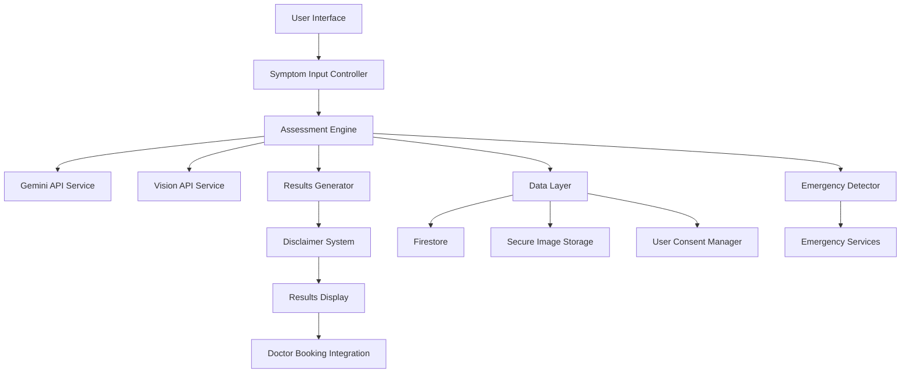

# Design Document - Symptoms Checker

## Overview

The Symptoms Checker is a sophisticated AI-powered health assessment tool that combines Google Gemini's natural language processing with Google Cloud Vision's image analysis capabilities. The system provides users with preliminary health assessments while maintaining strict medical compliance and encouraging professional healthcare consultation.

## Architecture

### High-Level Architecture



### System Components

1. **Frontend Layer**: Flutter-based responsive UI
2. **Business Logic Layer**: Dart services for symptom processing
3. **AI Integration Layer**: Google API clients and response handlers
4. **Data Layer**: Firestore for persistence, Cloud Storage for images
5. **Security Layer**: Encryption, authentication, and compliance

## Components and Interfaces

### 1. Symptom Input Controller

**Purpose**: Manages user input collection and validation

**Key Methods**:
```dart
class SymptomInputController {
  Future<void> collectTextSymptoms(String description, Duration duration, Severity severity);
  Future<void> uploadMedicalImage(File image);
  Future<bool> validateInput();
  Future<SymptomData> prepareAssessmentData();
}
```

**Responsibilities**:
- Text symptom collection with structured fields
- Image upload with validation and preprocessing
- Input sanitization and validation
- Data preparation for AI analysis

### 2. Assessment Engine

**Purpose**: Core logic for coordinating AI analysis and generating assessments

**Key Methods**:
```dart
class AssessmentEngine {
  Future<AssessmentResult> analyzeSymptoms(SymptomData data);
  Future<TextAnalysis> processWithGemini(String symptoms);
  Future<ImageAnalysis> processWithVision(File image);
  Future<UnifiedAssessment> correlateFindings(TextAnalysis text, ImageAnalysis image);
}
```

**Responsibilities**:
- Coordinate AI service calls
- Correlate text and image analysis results
- Generate confidence scores and recommendations
- Handle API failures and retries

### 3. Gemini API Service

**Purpose**: Interface with Google Gemini for medical text analysis

**Key Methods**:
```dart
class GeminiApiService {
  Future<GeminiResponse> analyzeMedicalText(String symptoms);
  Future<List<Condition>> identifyConditions(String analysis);
  Future<RiskAssessment> assessSeverity(String symptoms);
  String buildMedicalPrompt(SymptomData data);
}
```

**Configuration**:
- Medical-specific prompts and context
- Response parsing and validation
- Rate limiting and cost management
- Error handling and fallbacks

### 4. Vision API Service

**Purpose**: Interface with Google Cloud Vision for medical image analysis

**Key Methods**:
```dart
class VisionApiService {
  Future<VisionResponse> analyzeMedicalImage(File image);
  Future<List<VisualFeature>> extractMedicalFeatures(File image);
  Future<ImageClassification> classifyCondition(File image);
  Future<File> preprocessImage(File original);
}
```

**Features**:
- Medical image preprocessing
- Feature extraction for skin conditions, wounds, swelling
- Classification of visual symptoms
- Secure image handling and cleanup

### 5. Emergency Detector

**Purpose**: Identifies potentially urgent medical situations

**Key Methods**:
```dart
class EmergencyDetector {
  bool detectEmergencySymptoms(SymptomData data);
  EmergencyLevel assessUrgency(AssessmentResult result);
  List<String> getEmergencyKeywords();
  EmergencyResponse generateEmergencyGuidance(SymptomData data);
}
```

**Emergency Triggers**:
- Chest pain, difficulty breathing
- Severe bleeding, loss of consciousness
- Allergic reactions, severe pain
- Stroke symptoms, heart attack indicators

### 6. Disclaimer System

**Purpose**: Manages medical disclaimers and legal compliance

**Key Methods**:
```dart
class DisclaimerSystem {
  Future<bool> showInitialDisclaimer();
  Widget buildDisclaimerWidget();
  Future<void> recordUserConsent(String userId);
  bool validateConsent(String userId);
}
```

**Disclaimer Content**:
- "Not a substitute for professional medical advice"
- AI limitations and accuracy disclaimers
- Emergency situation guidance
- Data privacy and usage notices

## Data Models

### SymptomData Model

```dart
class SymptomData {
  final String userId;
  final String textDescription;
  final Duration symptomDuration;
  final Severity severity;
  final List<File> images;
  final Map<String, dynamic> structuredSymptoms;
  final DateTime timestamp;
  final MedicalHistory? userHistory;
}

enum Severity { mild, moderate, severe, extreme }
```

### AssessmentResult Model

```dart
class AssessmentResult {
  final String assessmentId;
  final List<PossibleCondition> conditions;
  final RiskLevel overallRisk;
  final List<Recommendation> recommendations;
  final double confidenceScore;
  final bool requiresEmergencyCare;
  final DateTime createdAt;
  final String disclaimer;
}

enum RiskLevel { low, medium, high, emergency }
```

### PossibleCondition Model

```dart
class PossibleCondition {
  final String name;
  final String description;
  final double probability;
  final Severity estimatedSeverity;
  final List<String> matchingSymptoms;
  final String educationalContent;
  final List<String> recommendedActions;
}
```

## Correctness Properties

*A property is a characteristic or behavior that should hold true across all valid executions of a system-essentially, a formal statement about what the system should do. Properties serve as the bridge between human-readable specifications and machine-verifiable correctness guarantees.*

### Property 1: Emergency Detection Reliability
*For any* symptom input containing emergency keywords or severe indicators, the Emergency Detector should always flag the case as requiring urgent medical attention and never provide false reassurance.
**Validates: Requirements 8.1, 8.2, 8.4**

### Property 2: Disclaimer Consistency
*For any* user interaction with the symptoms checker, appropriate medical disclaimers should be displayed at every stage, and user consent should be recorded before processing any health data.
**Validates: Requirements 3.1, 3.2, 3.4**

### Property 3: Data Security Round Trip
*For any* health data submitted by users, encrypting then decrypting should produce equivalent data, and all temporary processing data should be automatically cleaned up after analysis.
**Validates: Requirements 6.1, 6.3**

### Property 4: API Integration Resilience
*For any* API service failure (Gemini or Vision), the system should gracefully handle errors, implement appropriate retries, and provide meaningful feedback to users without exposing technical details.
**Validates: Requirements 7.3, 5.5**

### Property 5: Assessment Completeness
*For any* valid symptom input, the Assessment Engine should generate a complete result containing conditions, risk levels, recommendations, and appropriate disclaimers.
**Validates: Requirements 4.1, 4.2, 4.4**

### Property 6: Input Validation Consistency
*For any* user input (text or image), the system should validate format, content appropriateness, and completeness before processing, rejecting invalid inputs with helpful error messages.
**Validates: Requirements 1.4, 5.5**

### Property 7: Performance Guarantee
*For any* symptom assessment request, the system should complete processing within 10 seconds for 95% of cases, with appropriate loading indicators throughout the process.
**Validates: Requirements 2.5, 5.3**

### Property 8: Medical History Integration
*For any* user with existing medical history, the Assessment Engine should incorporate relevant historical data into current analysis while maintaining data privacy and user consent.
**Validates: Requirements 9.3, 6.2**

## Error Handling

### API Error Management
- **Gemini API Failures**: Fallback to cached responses for common symptoms
- **Vision API Failures**: Graceful degradation to text-only analysis
- **Network Issues**: Offline mode with limited functionality
- **Rate Limiting**: Queue management and user notification

### Data Validation Errors
- **Invalid Images**: Format validation with helpful error messages
- **Incomplete Symptoms**: Progressive validation with guidance
- **Malformed Input**: Sanitization and correction suggestions

### Emergency Handling
- **False Negatives**: Conservative approach, always recommend professional evaluation
- **System Failures**: Direct emergency contact information display
- **Critical Errors**: Immediate escalation to emergency services

## Testing Strategy

### Unit Testing
- Individual component functionality
- API integration mocking
- Data validation logic
- Emergency detection algorithms

### Property-Based Testing
- Generate random symptom combinations
- Test emergency detection across symptom variations
- Validate data encryption/decryption cycles
- Test API failure scenarios with random inputs

### Integration Testing
- End-to-end symptom assessment flows
- AI service integration validation
- Database operations and data persistence
- User consent and privacy compliance

### Medical Accuracy Testing
- Collaborate with medical professionals for validation
- Test against known medical cases
- Validate emergency detection accuracy
- Assess recommendation appropriateness

### Performance Testing
- Load testing with concurrent users
- API response time monitoring
- Image processing performance
- Memory usage optimization

### Security Testing
- Data encryption validation
- API key security
- User data privacy compliance
- Penetration testing for vulnerabilities